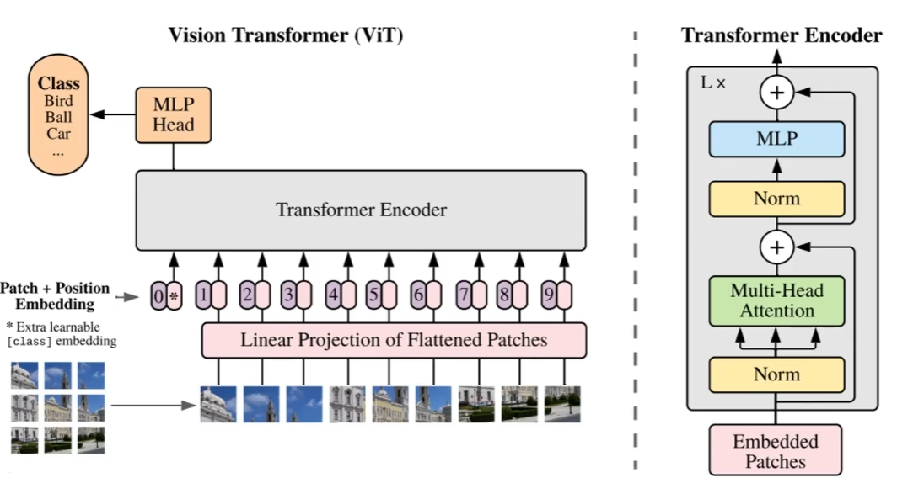
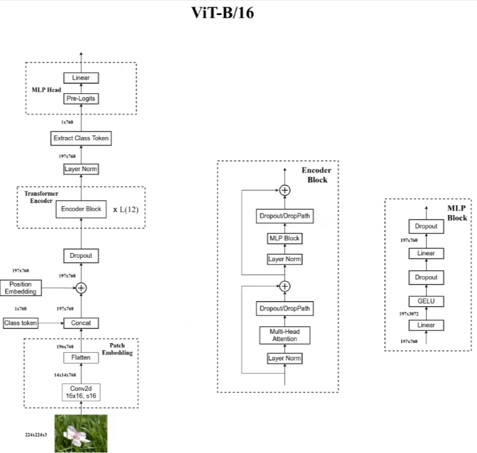

# transformer笔记

ViT主体在`vit_model`文件中

## 普通的transformer框架

- 编码端输入：Embedding + Positional Coding，输出X

- Encoder x L1：
  - 多头自注意力机制，输出Y
  - 将Y和X残差链接，并进行加法和层归一化，输出X1
  - 前馈网络，输出Y1
  - 将Y1和X1残差链接，并进行加法和层归一化，输出X2
- 解码端输入：Embedding + Positional Coding，输出X
- Decoder x L2：
  - 多头自注意力机制，输出Y
  - 将Y和X残差链接，并进行加法和层归一化，输出X1
  - Encoder-Decoder attention，编解码注意力机制，查询使用解码器的输入X1，key-value使用编码器的输入，输出X2
  - 将X1和X2残差链接，并进行加法和层归一化，输出Z
  - 前馈网络，输出Z1
  - 将Z1和Z残差链接，并进行加法和层归一化

## Vision Transformer(ViT)

对于一张图像来说，为了对图像编码成一个序列，将图像划分为多个Patch，然后对每个Patch展平处理成一个向量。对patch进行展平，是通过卷积核来实现的，该卷积核的kernel_size=patch_size且stride=patch_size

因为图像是二维信息，位置编码时可以考虑使用二维坐标来编码，如(x,y)，或者就是一维编码，如1，2，3等。实验表明两者差别不大

ViT的Embedding阶段额外加入了一个0向量，这是为了整合其他所有向量的信息，也就是整合一个全局信息，这样处理通常是用在图像分类任务中。

ViT模型只有在非常大的数据集上进行训练才会获得很好的效果。所以平时可以直接使用官方提供的预训练权重进行迁移学习。

### 框架具体细化

## 代码使用简介

1. 下载好数据集，代码中默认使用的是花分类数据集，下载地址: [https://storage.googleapis.com/download.tensorflow.org/example_images/flower_photos.tgz](https://storage.googleapis.com/download.tensorflow.org/example_images/flower_photos.tgz),
   如果下载不了的话可以通过百度云链接下载: https://pan.baidu.com/s/1QLCTA4sXnQAw_yvxPj9szg 提取码:58p0
2. 在`train.py`脚本中将`--data-path`设置成解压后的`flower_photos`文件夹绝对路径
3. 下载预训练权重，在`vit_model.py`文件中每个模型都有提供预训练权重的下载地址，根据自己使用的模型下载对应预训练权重
4. 在`train.py`脚本中将`--weights`参数设成下载好的预训练权重路径
5. 设置好数据集的路径`--data-path`以及预训练权重的路径`--weights`就能使用`train.py`脚本开始训练了(训练过程中会自动生成`class_indices.json`文件)
6. 在`predict.py`脚本中导入和训练脚本中同样的模型，并将`model_weight_path`设置成训练好的模型权重路径(默认保存在weights文件夹下)
7. 在`predict.py`脚本中将`img_path`设置成你自己需要预测的图片绝对路径
8. 设置好权重路径`model_weight_path`和预测的图片路径`img_path`就能使用`predict.py`脚本进行预测了
9. 如果要使用自己的数据集，请按照花分类数据集的文件结构进行摆放(即一个类别对应一个文件夹)，并且将训练以及预测脚本中的`num_classes`设置成你自己数据的类别数